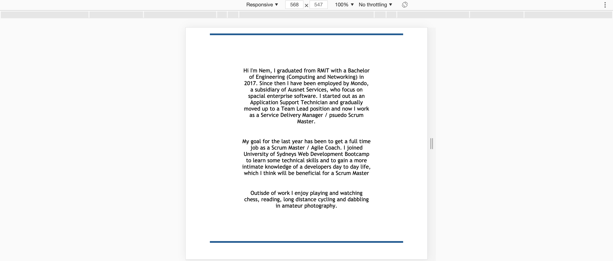

# Updated-Portfolio

## Installation

To clone and run this project, please make sure you have git installed.

run `git clone https://github.com/Nem-Ajvaz/Updated-Portfolio.git`

## Introduction

The purpose of this project was to update my personal portfolio for my web development journey. When visiting this page you will be able to view my LinkedIn profile, contact me via Email and ofcourse and view my completed projects on GitHub. Each project that listed on my portfolio will have a link to the live github page as well as the repository.

## Images

Portfolio at a width greater than 890px

Portfolio at a width less than or equal to 890px

Portfolio at a width less than or equal to 600px

## Issues faced

I didn't face any issues with this project.

## Lisence

MIT
